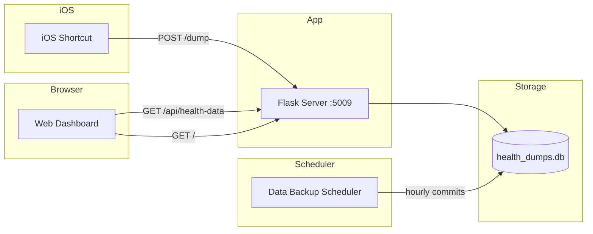

# iOS Health Dump

Backend service and web dashboard for receiving, storing, and visualizing daily health metrics (steps, calories, distance, flights climbed) from iOS via Shortcuts.

## Tech Stack

- Python 3.12 / Flask backend
- SQLite for health data storage
- Modern web frontend (HTML5, CSS3, vanilla JavaScript)
- Chart.js for time series visualization
- Cloudflared for secure tunneling

## Architecture



## Prerequisites

- Python 3.12+
- [uv](https://github.com/astral-sh/uv) for dependency management

## Installation

1. Clone the repository:
```bash
git clone https://github.com/momonala/ios-health.git
cd ios-health
```

2. Install dependencies:
```bash
uv sync
```

## Running

```bash
uv run python -m src.app
```

Server runs at http://localhost:5009

Open http://localhost:5009 in your browser to view the dashboard.

### Data Backup Scheduler

Run the scheduler to auto-commit database changes hourly:
```bash
uv run python -m src.data_backup_scheduler
```

The scheduler checks for database changes every hour and commits them to git. If a commit already exists for the current day, it will amend that commit instead of creating a new one, keeping the git history clean with one commit per day.

## Testing

Run all tests with coverage (configured in pytest.ini):
```bash
uv run pytest
```

Run a specific test file:
```bash
uv run pytest tests/test_datamodels.py
```

Generate HTML coverage report:
```bash
uv run pytest --cov-report=html
```

Note: Test files are excluded from coverage reports.

## Pre-commit Hook

A pre-commit hook is installed that automatically runs:
1. Tests (`uv run pytest`)
2. Code formatting (`uv run black .`)
3. Linting (`uv run ruff check . --fix`)

The hook is installed at `.git/hooks/pre-commit`. To reinstall it:
```bash
cp pre-commit.sh .git/hooks/pre-commit
chmod +x .git/hooks/pre-commit
```

To skip the hook for a single commit:
```bash
git commit --no-verify
```

## Project Structure

```
ios-health/
├── src/
│   ├── app.py                    # Flask application & routes
│   ├── datamodels.py             # HealthDump dataclass
│   ├── db.py                     # SQLite connection utilities
│   ├── ios_health_dump.py        # Health dump upsert logic
│   └── data_backup_scheduler.py  # Auto-commits DB changes hourly
│
├── tests/                        # Test suite
│   ├── test_app.py
│   ├── test_datamodels.py
│   ├── test_db.py
│   └── test_ios_health_dump.py
│
├── templates/
│   └── index.html            # Dashboard HTML template
│
├── static/
│   ├── css/
│   │   └── styles.css        # Dashboard styles (iOS Health inspired)
│   └── js/
│       └── dashboard.js      # Dashboard logic & Chart.js integration
│
├── install/
│   ├── install.sh                                      # Setup script for Raspberry Pi
│   ├── projects_ios-health-dump.service                # Systemd service for Flask
│   └── projects_ios-health-data-backup-scheduler.service  # Systemd service for scheduler
│
├── health_dumps.db           # SQLite database (generated)
└── pyproject.toml            # Dependencies & tool config
```

## API Endpoints

| Endpoint | Method | Description |
|----------|--------|-------------|
| `/` | GET | Web dashboard (HTML) |
| `/status` | GET | Health check |
| `/api/health-data` | GET | Get all health data (JSON) |
| `/dump` | POST | Save health data from iOS |

### GET /api/health-data

Returns all health data sorted by date (most recent first).

Response:
```json
{
  "data": [
    {
      "date": "2026-01-03",
      "steps": 10000,
      "kcals": 500.5,
      "km": 8.2,
      "flights_climbed": 50,
      "recorded_at": "2026-01-03T14:30:00+01:00"
    }
  ]
}
```

### POST /dump

```bash
curl -X POST http://localhost:5009/dump \
  -H "Content-Type: application/json" \
  -d '{"steps": 10000, "kcals": 500.5, "km": 8.2, "flights_climbed": 50}'
```

Request body:
```json
{
  "steps": "integer (required)",
  "kcals": "float (required)",
  "km": "float (required)",
  "flights_climbed": "integer (optional)"
}
```

Response:
```json
{
  "status": "success",
  "data": {
    "date": "2026-01-03",
    "steps": 10000,
    "kcals": 500.5,
    "km": 8.2,
    "flights_climbed": 50,
    "recorded_at": "2026-01-03T14:30:00+01:00"
  },
  "row_count": 42
}
```

## Dashboard Features

The web dashboard provides an iOS Health App-inspired interface with:

- **Today's Summary**: Large metric cards showing steps, calories, distance, and flights climbed with progress rings
- **Statistics**: Average values and totals for week/month/year periods
- **Time Series Charts**: Interactive line charts for all metrics using Chart.js
- **Recent Activity**: Sortable table with all activity data
- **Responsive Design**: Works on mobile and desktop
- **Dark Theme**: iOS-inspired dark color scheme

## Key Concepts

| Concept | Description |
|---------|-------------|
| **Upsert logic** | Only keeps the latest entry per day; older duplicates are skipped |
| **Timezone** | All times normalized to Europe/Berlin |
| **Auto-commit** | Scheduler commits DB changes to git hourly; amends same-day commits |
| **Goals** | Default goals: 10,000 steps, 500 kcal, 8 km, 50 flights climbed (configurable in frontend) |

## Data Models

```
HealthDump
├── date: str (YYYY-MM-DD, primary key)
├── steps: int
├── kcals: float
├── km: float
├── flights_climbed: int
└── recorded_at: datetime (ISO timestamp)
```

## Storage

| File | Purpose |
|------|---------|
| `health_dumps.db` | SQLite DB for daily health metrics |
| `health_dumps.db.bk` | Backup created on each commit |

## Deployment

The `install/` folder contains scripts for deploying to a Raspberry Pi with systemd and Cloudflared:

```bash
cd install
./install.sh
```

This will:
1. Install uv and project dependencies
2. Set up systemd services for Flask and the scheduler (both enabled and started)
3. Configure Cloudflared tunnel for `ios-health-dump.mnalavadi.org`

The scheduler service runs as a long-running process (`Type=simple`) that checks for database changes hourly and commits them to git, amending same-day commits when applicable.
